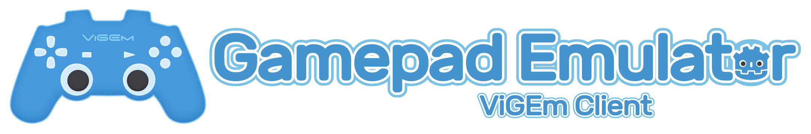
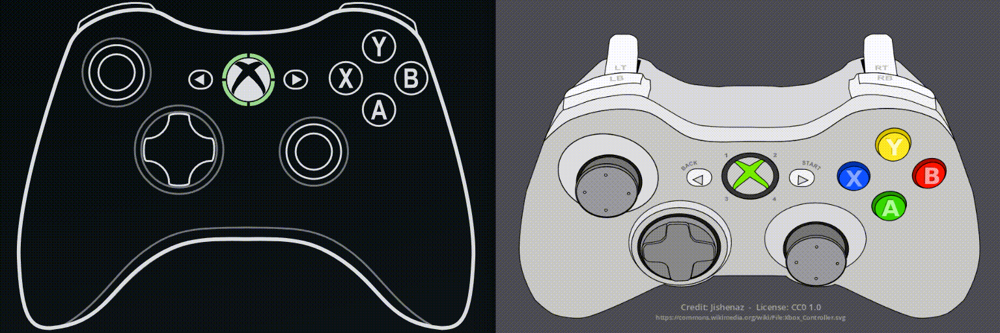

"Do you not have an XBox or Dual Shock controller? You get one free."

This addon wraps the famous [nefarius/ViGEmBus](https://github.com/nefarius/ViGEmBus) driver in a node-like API.

**Use cases:**

- Testing your game's controller support when you don't have an XBox or Sony controller.
- Replaying controller input sequences accurately (to polish the feeling of your combat system etc.).
- Hijacking inputs of a controller at system level and forward to a virtual one ([HidHide](https://github.com/nefarius/HidHide) is recommended as a companion for this use case).
- And more, you get the idea.

**Disclaimer:**

- Not to be confused with "virtual joystick" and "virtual gamepad", which is typically an input widget that allows touchscreen players to interact with your game in a console-like manner.
- This addon is for *Windows* only.
- ViGEm is [no longer maintained](https://docs.nefarius.at/projects/ViGEm/End-of-Life/) by its original author, but as a time-tested project it has served its users well. This addon only supports emulating controllers that ViGEm can, which are XBox 360 Controller and Dual Shock 4.

## Installation

To install the addon:

1. **Make sure you have [ViGEmBus driver](https://github.com/nefarius/ViGEmBus#installation) installed** (typically you'll need to reboot after installing it),
2. Grab the latest **godot-vigem.zip** in [addon release page](https://github.com/lfod1997/godot-vigem/releases/latest),
3. Unzip everything into `YOUR_PROJECT/addons/godot-vigem/`,
4. Open your project in *Godot Editor*, a line should have been printed: "Connected to ViGEm bus driver.", meaning everything's ready.

## Usage

1. Add a `XBox360ControllerEmulator` or `DualShock4Emulator` node into the scene tree to create a virtual controller device,
2. Call its `send_event` method with an [InputEventJoypadButton](https://docs.godotengine.org/en/stable/classes/class_inputeventjoypadbutton.html) or [InputEventJoypadMotion](https://docs.godotengine.org/en/stable/classes/class_inputeventjoypadmotion.html) of your definition,
3. Your virtual controller will send the event to your system, emulating a real controller connected to one of your USB ports,
4. Of course that event will loop back into your game, because IT'S ACTS LIKE A REAL ONE,
5. Removing the node from scene tree frees the virtual controller device.

## Contributing

- Please note that this addon is for Windows only.
- Requires [Visual Studio with "Desktop development with C++" workload](https://learn.microsoft.com/en-us/cpp/build/vscpp-step-0-installation).
- Clone the repo with submodules: `git clone --recursive git@github.com:lfod1997/godot-vigem.git`.
- It is recommended to use the [now-free](https://blog.jetbrains.com/clion/2025/05/clion-is-now-free-for-non-commercial-use/) CLion IDE, because build profiles and a run configuration have been added for the project.
- Alternatively, make sure you have [CMake ≥ 3.25](https://cmake.org/download/):
  - To build for `template_debug` with `Debug` config:
    - Configure: `cmake -S . -B cmake-build-debug -DCMAKE_BUILD_TYPE=Debug`
    - Build: `cmake --build cmake-build-debug --target gdvigem --config Debug`
  - To build for `template_release` with `Release` config:
    - Configure: `cmake -S . -B cmake-build-release -DCMAKE_BUILD_TYPE=Release -DGODOTCPP_TARGET=template_release`
    - Build: `cmake --build cmake-build-release --target gdvigem --config Release`
  - To build for [double-precision Godot](https://docs.godotengine.org/en/stable/tutorials/physics/large_world_coordinates.html), add `-DGODOTCPP_PRECISION=double` when configuring.
- Demo project at `/project/project.godot`.
